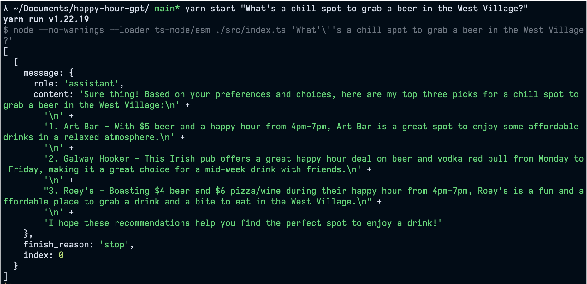
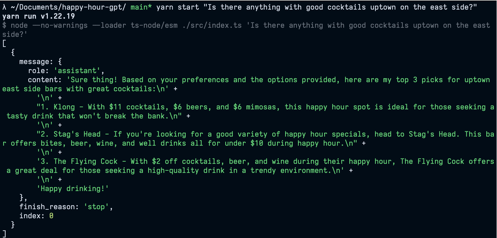
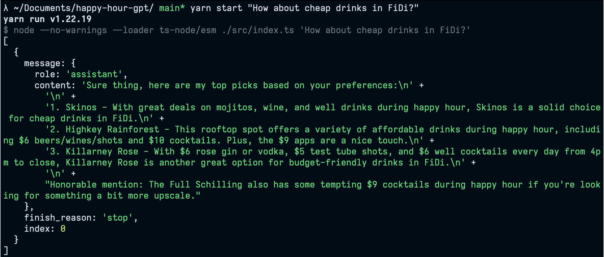

# OpenAI Api Exploration with Embeddings

> The goal of this is to create a program that acts as an NYC bar/happy hour recommender. It uses OpenAI's embeddings API to base the recommendations off a list of bars found in the csv files in the `data` directory.

**Note: This README needs some TLC that's simply not available from me at 2am.**

## Running

1. Create a `.env` file in the repository (see `.env.example`) and add your OpenAI credentials.
2. Run `yarn start "The prompt goes here"`.
3. Usually the first run will request and create the embeddings, but I'm commiting the embeddings to this repo for `drinks-happy-hour.csv`.

If you want to try out another data file you can create a new embedding context by basically copying the existing code in `src/index.ts`.
Expect a 30-60 second first run of the program when doing this. Subsequent executions will be significantly faster at around 5 seconds.

## Examples

I'm pretty damn impressed with how good it is off the bat. Pretty much no tweaking of anything, no error handling (lol), no logging, no prompt engineering.

